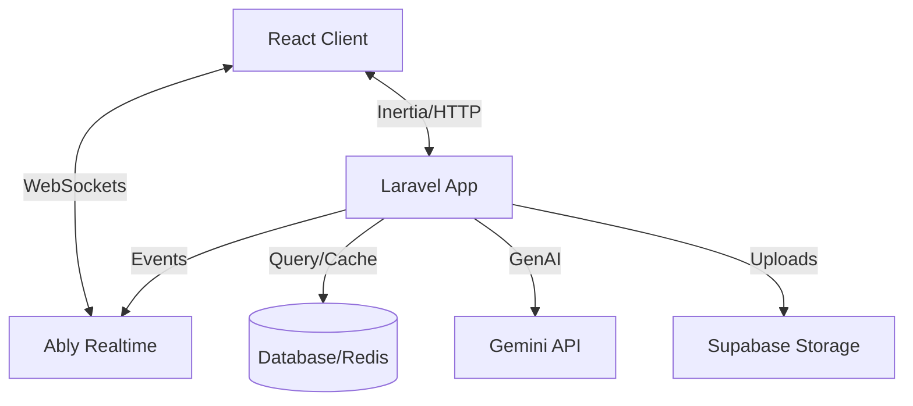

# ⚡ Quizz - High-Performance Competitive Trivia Platform


**Quizz** is an grade competitive quiz platform engineered for speed, scalability, and engagement. It leverages real-time WebSockets to deliver sub-millisecond state synchronization in 1v1 trivia battles. Featuring an AI-driven question engine and a secure, robust architecture, Quizz provides a premium gaming experience.


---

## 🚀 Core Features

### ⚔️ Real-Time Arena Engine

- **Low-Latency Multiplayer**: Powered by **Ably**, ensuring instant state synchronization across clients.
- **Smart Matchmaking**: optimized Redis-backed lobby system that pairs opponents based on ELO and availability.
- **Sequential Rematch Logic**: Seamlessly request rematches with opponents; the server automatically spins up new game instances upon mutual agreement.
- **Dynamic Gameplay**: Time-decay scoring algorithms reward precision and speed.

### 🛡️ Grade Security

- **Robust Authentication**: Rate-limited login endpoints (5 attempts/min) and enforced strong password policies (NIST compliant).
- **Secure API Architecture**: Built on **Laravel Sanctum** with token capability checks.
- **Input Validation**: Comprehensive server-side validation for all game inputs to prevent tampering.

### 🧠 AI & Content

- **GenAI Integration**: Automated question generation and localization using **Google Gemini**, creating an infinite content stream.
- **Bilingual Localization**: Native support for **English** and **Burmese** across the entire interface and content library.

### 🎨 Premium Experience

- **Glassmorphism UI**: A sophisticated, translucent design language built with **Tailwind CSS 4.0**.
- **Immersive Visuals**: 3D interactive elements and smooth, physics-based animations via **Framer Motion**.
- **Adaptive Theming**: Intelligent light/dark mode switching based on ambient preference.

---

## 🛠 Technology Stack

### Backend Infrastructure

- **Framework**: [Laravel 12](https://laravel.com) (PHP 8.2+)
- **Data Layer**: MySQL (Production) / SQLite (Dev)
- **Caching & State**: Redis
- **Real-time**: [Ably](https://ably.com) (Pub/Sub)
- **Object Storage**: [Supabase](https://supabase.com) (S3-compatible)

### Frontend Application

- **Core**: [React 19](https://react.dev)
- **Hydration**: [Inertia.js 2.0](https://inertiajs.com)
- **State Management**: React Hooks + Ably Presence
- **Styling**: [Tailwind CSS 4.0](https://tailwindcss.com)

---

## ⚡ Quick Start Guide

### Prerequisites

- PHP >= 8.2
- Node.js >= 20
- Composer
- Services: Ably API Key, Google Gemini API Key, Supabase Credentials

### 1. Installation

```bash
git clone https://github.com/toewaioo/Quizz.git
cd Quizz

# Install dependencies
composer install
npm install
```

### 2. Configuration

Copy the environment file and configure your credentials:

```bash
cp .env.example .env
```

Ensure the following keys are set in `.env`:

```ini
# Core
APP_URL=http://localhost:8000

# Service Keys
ABLY_KEY=your_ably_key
GEMINI_API_KEY=your_gemini_key
SUPABASE_URL=your_supabase_url
SUPABASE_API_KEY=your_key
```

### 3. Initialization

```bash
php artisan key:generate
touch database/database.sqlite
php artisan migrate
php artisan db:seed --class=QuestionSeeder
```

### 4. Deployment

Start the development servers:

```bash
composer run dev
```

---

## 📂 Architecture Overview



## 📄 License

This project is open-sourced software licensed under the [MIT license](https://opensource.org/licenses/MIT).
